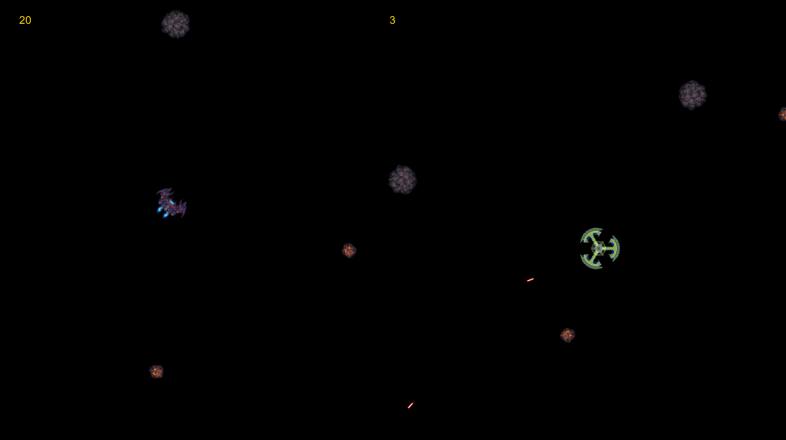

# asteroids-game

System Requirements
- It was tested on Windows 10 - 64 bits
- Memory: 1 GB RAM
- Storage: 49,8 MB of space available

Game Install instructions
- Unzip the [file](https://github.com/indexhever/asteroids-game/releases/download/v1.0.0/1.0.0.zip) found here: https://github.com/indexhever/asteroids-game/releases/tag/v1.0.0
- Run the AsteroidsGame.exe

How to play
- Press Up Arrow key for moving
- Press Left or Right arrow keys for rotating
- Press Ctrl key for shooting
- Avoid beeing hit by bullets (even your bullets), asteroids and spaceships
- You win after destroying all asteroids
- You gain points after destroying asteroids or spaceships
- Spaceships give more points when destroyed
- Everything that crosses screen sides are teleported to oposed sides.
- You have 3 lives. After loosing them, game over.
